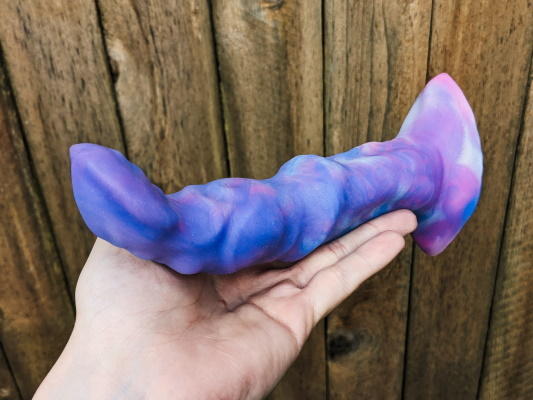
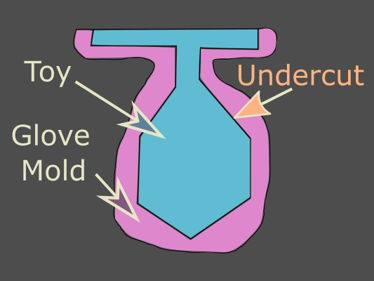
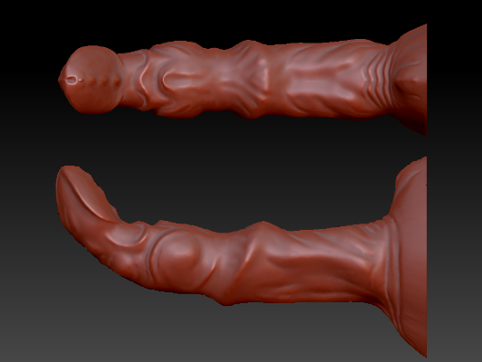
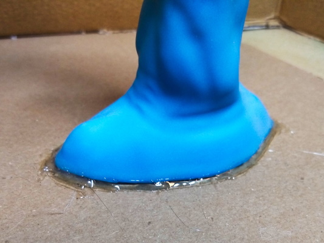
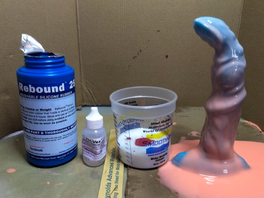
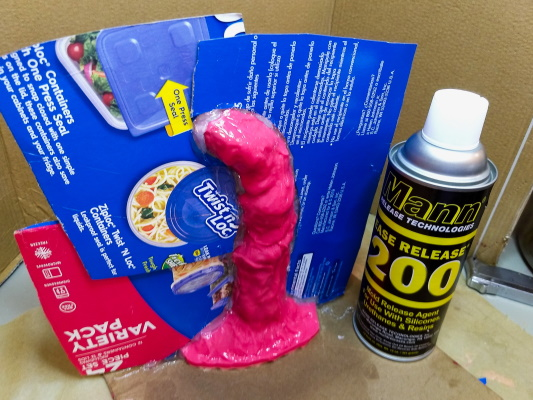
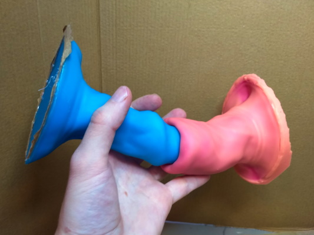
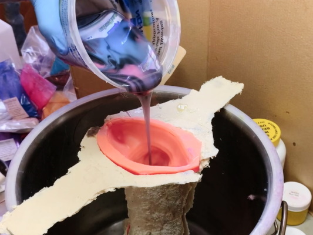
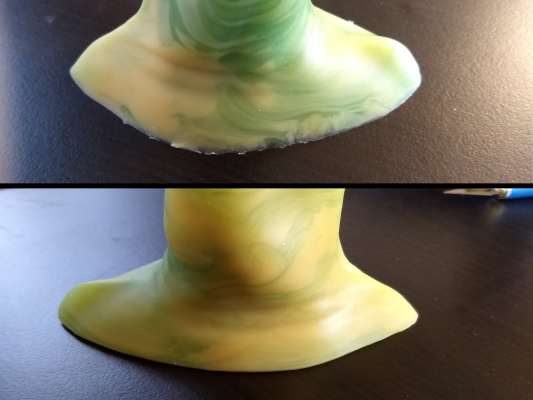
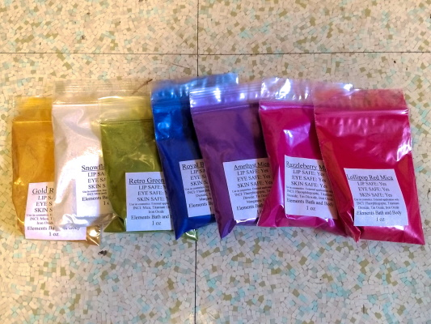

# Cocksmithing: *a guide to crafting professional-quality silicone dildos at home*
  
*If you find this work helpful, please consider leaving me a tip with [Ko-Fi](https://ko-fi.com/starkatt). How about 3% of what you spend on materials crafting your first toy?*  
        
# Introduction
This guide describes a process for handcrafting high-quality silicone dildos of your own design. With care and practice, it's entirely possible to produce toys similar in quality to those sold by major vendors.
    
I've created this document with the hopes of providing fellow craftswomen (&etc) the information necessary to get started in toymaking.  I'm not an expert. The techniques given here have worked well for me, but it's entirely possible there's better methods I haven't yet discovered. I've made small production runs for personal use and sale to friends, but have never manufactured toys for a living.  
  
Pictured throughout this guide is the making of my toy *Crush Depth*, designed and handcrafted over the winter of 2020-2021.  

    
  
The source version of this document is located on [GitHub](https://github.com/starkatt/Cocksmithing/blob/master/cocksmithing.md]). This work is licensed under a [Creative Commons Attribution-ShareAlike 4.0 International License](https://creativecommons.org/licenses/by-sa/4.0/).
        
If you have any questions or comments, please don't hesitate to reach out via email: cocksmith@fastest.cc  
  	 
## Process Overview    
There are many, many ways to make high-quality silicone sex toys. The process given in this document is only one path.
  
Here's an extremely brief overview of the steps described:
  
1. Digitally model your design.
2. 3D print a *primary model* positive.
3. Smooth the surface of primary model with a specialty epoxy.
4. Brush a single-piece silicone *glove mold* on to the primary model, in multiple layers.
5. Use a reinforced epoxy to build a two-part support shell around the glove mold.
6. Remove the primary model. The glove mold and the support shell together now form a *production mold*.
7. Mix silicone for the final product, adding pigment. Vacuum degas the mixture to remove bubbles.
8. Pour the mixed silicone into the production mold, and allow to cure.
9. Toy complete!

I highly recommend reading this document completely before getting started.  
  
#### Table of Contents:  
1. [Introduction](#introduction)  
	- 1.1 [Process Overview](#process-overview)
	- 1.2 [Time and Costs](#time-and-costs)
2. [Toy Design and Modeling](#toy-design-and-modeling)
	- 2.1 [Design Constraints](#design-constraints)
	- 2.2 [3D Modeling a Toy](#3d-modeling-a-toy)
3. [Creating the Primary Model](#creating-the-primary-model)
	- 3.1 [Print](#print)
	- 3.2 [Print Cleanup](#print-cleanup)  
	- 3.3 [Smoothing with XTC-3D](#smoothing-with-xtc-3d)
	- 3.4 [*Extra Credit: Blasted Finish*](#extra-credit-blasted-finish)
4. [Creating a Production Mold](#creating-a-production-mold)
	- 4.1 [Applying a Glove Mold](#applying-a-glove-mold)
	- 4.2 [Building a Support Shell](#building-a-support-shell)
	- 4.3 [Finishing the Production Mold](#finishing-the-production-mold) 
5. [Pouring a Toy](#pouring-a-toy)
	- 5.1 [Pour Preparation](#pour-preparation)  
	- 5.2 [Mixing](#mixing)
	- 5.3 [Degassing](#degassing)
	- 5.4 [Pouring](#Pouring)
	- 5.5 [*Advanced: Marbled Pour*](#advanced-marbled-pour)  
	- 5.6 [*Optional: Trimming*](#optional-trimming)
6. [Tools & Materials](#tools--materials)
	- 6.1 [Shopping List](#shopping-list)
	- 6.2 [Tools](#tools)
	- 6.3 [Toy Materials](#toy-materials)
	- 6.4 [Mold-Making Materials](#mold-making-materials)
	- 6.5 [Consumables](#consumables)
7. [Additional Contributors](#additional-contributors)

	
## Time and Costs    
The vast majority of the time and expense involved in this project is spent creating the initial production mold. Once the mold has been made, each copy of the toy requires relatively little effort and marginal cost.   
  
This is not a project that can be finished in a weekend. I'm hesitant to give estimates (digital modeling in particular can take anywhere between near-zero and infinite time), but definitely plan on dedicating some real hours to this.  
  
The cheapest viable vacuum chamber and pump is about $145 (including oil). If you don't already have access to one, decent 3D printers are available for under $250. 
  
This project also uses a minimum of about $250 in materials, *if* everything goes right the first time.   
  
Significantly more detail can be found in the [Tools & Materials](#tools--materials) section of this document.
  
Quality is asymptotic. Producing one okay-ish toy will require a certain baseline of time and money, but if you're anything like me you may feel compelled to revisit, revise, and refine various steps of the production process. Costs can add up faster than you might think.  
  
If you want to make very large toys, consider first getting started with something small to medium sized. Smaller pours are much easier to iterate and improve while still keeping your budget under control.

# Toy Design and Modeling
The first step in crafting your own dildo is to create a positive primary model of the toy. This will be used to form the inner shape of a silicone glove mold negative. The main method discussed here will be to design the toy digitally and then 3d print a primary model for sculpting. Other options include hand-sculpting a model with clay, wax, sculpey, or similar.
  
One thing I want to emphasize is that the silicone mold-making process produces *exact* replicas of whatever the shape of the primary model is, in literally microscopic detail. Any surface aberration, no matter how small, will be reproduced in the finished toy. This is especially relevant if you decide to hand-sculpt instead of work digitally. 
  
## Design Constraints
  
### Flat Base
This guide is written assuming the toy will have a flat, reasonably stable base. The toy is poured with the tip down, so the level top surface of the poured liquid silicone creates a flat base plane.  
  
I also strongly recommend that all toys be designed with a flared base, to reduce risk of anything getting lost internally. Design the base of your toy with a bit of extra thickness, since it's easier to not have to pour silicone up to the very brim of the mold.
  
### No Excessive Undercut  
An undercut is any feature that prevents the toy being removed from the mold. With the single-piece glove mold technique described in this document, this is generally any shape where a toy widens towards the tip. Since the glove mold is flexible there is some tolerance for small amounts of undercut like bumps and ridges, but extreme undercuts such as a buttplug shape would require use of a two-part block mold.
  
  
  
The *Crush Depth* design pictured throughout this document has multiple areas of moderate undercut. This makes demolding a bit more difficult, but the design is still viable due to the flexibility of the glove mold. The design would probably *not* be feasible if the variations in overall circumference were substantially greater.

### No Bubble Traps  
The toy will be poured with the mold tip-down. As you pour, the level of silicone in the mold will rise evenly, starting from the lowest point in the mold. Design your model so that there are no pockets where escaping air or rising bubbles will become trapped, or else the finished toy will be plagued by bubble pores.   
  
  
       
## 3D Modeling a Toy  
A full overview of 3D sculpting and modeling methods is beyond the scope of this document. All skills are learnable, and modeling is no exception. 

Use whatever software is most comfortable for you.   
  
Blender is a free modeling program that is extremely comprehensive, though its user interface is a lot more clunky than other software. More professional-oriented digital sculpting tools include ZBrush and Mudbox, though getting a legitimate license can be exceedingly expensive. Going another route, you can also use CAD software ranging from something as bare-bones as OpenSCAD to something as complex as Autodesk.  
  

    
Any program capable of creating an `.stl` file for 3d printing will work. If you get started using software that you're not familiar with -- especially free software -- make sure it can export to `.stl` before you invest too much time in making a model.  
  
It may be extremely helpful to create a rough sketch or physical approximation of a toy before starting on a digital sculpt, to provide reference for the desired dimension and proportions. A toy will frequently look different as a physical object than it did as a computer model.  
  
You may want to slightly exaggerate the depth of any texturing or detailing, since the `XTC-3D` epoxy (used to smooth print lines) does soften surface features.
  
# Creating the Primary Model
## Print 
Make sure your printer is properly tuned and calibrated. Information about suitable printers can be found in the [Tools](#3d-printer) section.
  
3D print your toy.  
    
The finer the layer height, the less surface finish post-processing you'll need to do. Similarly, areas needing support material will require additional post-processing (though, note, designing to minimize undercut should already reduce the need for supports).  

Depending on the way your modeling program is set up, it may take multiple iterations to get a correct scale factor for printing. 
  
## Print Cleanup 
Clean up any crud left over from an imperfect print. Trim or sand down any bumps, lumps, stringers, rough center lines, etc.  
  
If you're using an SLA (resin) printer, you also need to clean and UV post-cure your print. [Smooth-On recommends](https://www.smooth-on.com/support/faq/210/) a dedicated UV cure chamber or a minimum of six hours in direct sunlight.

## Smoothing with XTC-3D  
If you want to go directly from raw 3D print to production mold, there's nothing stopping you. However, I strongly encourage taking the time to refine the primary model to a quality surface finish. In particular, you probably don't want your silicone toy to have visible print layer lines. The casting process creates **exact replicas**, so the finish of your final toy will be exactly as good or as bad as the finish of your model.     
  
`Smooth-On XTC-3D` is a self-leveling epoxy that can be brushed on to a 3D print and hardens to produce an exceptionally smooth, glossy surface. One small kit should be plenty for many coats on typical sized toys. 
  
Each kit comes with a tiny mixing cup and one foam brush. So that you're not limited to one coat, I suggest getting additional graduated cups and brushes. I also prefer chip brushes over the included foam brush. The mixing cup *might* survive more than one use if you're lucky, but definitely not more than two.
  
Before you mix the epoxy, secure the primary model so that its base isn't resting flat on your work surface, to prevent epoxy from pooling and creating an "elephant's foot". Also, make sure you have a way to stably hold the model while brushing, and that it won't tip over while it cures. I've been able to meet all of these needs by hot gluing the model to a small block on top of a wooden stir stick.  
  
Nitrile or vinyl gloves should be worn whenever silicones or epoxies are being mixed and applied. While uncured silicones and epoxies are both unpleasant to get on your hands, epoxy in particular can cause severe reactions with repeated unprotected exposure.

  
Mix the `XTC-3D` epoxy, **2A:1B**. A few ml is probably plenty. Pot life is 10 minutes.
  
Cleanliness is important here. Tiny specks of dust can easily get on the model or into the epoxy, and the pinpoint bumps they leave may be visible in a finished cast.    
    
Brush the mixed `XTC-3D` on to the model. The epoxy is both powerfully self-leveling and extremely sticky. Brush into as thin a layer as possible.   
  
Once an area is wetted, it will stay wet even when brushed again. Keep brushing downwards to spread the epoxy thinly, paying special attention to concave spots where it can easily pool. Excess epoxy will form sags or runs as it creeps downwards. Also, check carefully for any missed dry spots.  
  
Bubbles are your enemy. Brush out large bubbles. Small bubbles can often be eliminated by *quickly* skimming the wet epoxy surface with the heat from a torch flame. 

  
Allow the coating to fully cure before handling the model. The listed tack free time is two hours, but full hardness takes several times longer.
  
An experienced professional could probably get satisfactory coverage in a single coat, but so far I've needed to use two coats. Sand out any imperfections in the first coat -- bubbles, runs, etc -- before re-coating.  
  
### *XTC-3D Alternatives* 
If you can't (or don't want to) use `XTC-3D`, another way to smooth the toy is by hand-sanding with successive sandpaper grits and finishing with coats of urethane. This is way more work and I don't recommend it.  
  
Other attested ways of smoothing 3D prints include acetone vapor smoothing for ABS, and alternating sanding with coats of high-build primer. I haven't tried them.

## *Extra Credit: Blasted Finish*  
The `XTC-3D` coating leaves a glossy finish that is perfectly reasonable for a finished toy. However, professional silicone toys are generally matte, which may be slightly better for holding lube. 
 
Bead-blasting is an excellent way to achieve a professional, uniform, anisotropic matte finish. Finish blasting might also be useful for clearing any remaining small surface imperfections.   
  
Harbor Freight sells a crappy (but adequate) hopper-fed blast gun for under $20. I've gotten great results using a very fine mix of glass bead and abrasive media. 
  
Blast outdoors, and wear a a dust mask (or better) for respiratory protection. If you have access to an actual blast cabinet, even better.
  
# Creating a Production Mold    
Although many mold-making tutorials describe the creation of a two-part block mold, for dildo-shaped objects without excessive undercut a single-piece glove mold is both easier and more economical.   
  
The mold silicone is applied to the primary model in a continuous, thin layer. Finished cast pieces can be safely removed by turning the mold inside-out.  

  
Since the glove mold is thin and flexible, in order to hold its shape for casting it needs to be backed by a rigid two-part support mold, sometimes called a "mother mold". Traditionally these have been made using raw fiberglass fabric and epoxy layups. For this project, using `Plasti-Paste II` fiber-reinforced epoxy is considerably easier. 
  
One mold can be reused many times.

## Applying a Glove Mold  

### Model Preparation  

Use hot glue to mount the primary model on a disposable, flat base surface. A sheet of cardboard works well.

In the final casting step, the mold will need to be held base-up while the silicone cures. The easiest way to do this is to make part of the support shell wide enough that the mold can sit suspended over the mouth of a bucket (tip: the vacuum chamber used for degassing is likely a convenient, bucket-shaped object). Therefore, it's a good idea to use a base surface wide enough to bridge the bucket mouth, and to place marks on the base surface indicating the required span.     
  
To prevent silicone from creeping underneath, use more hot glue to seal around the bottom edge of the model   
    

      
Spray the primary model and base surface with `Ease Release 200`. If this isn't done, the glove mold will adhere to the primary model and probably be unusable. The product literature for `Ease Release` says to use use a multi-step process of spraying, brushing, and spraying again, but I haven't found that to be necessary -- a light mist that covers all surfaces is sufficient. Too much mold release can actually result in a finished toy with an unpleasant, sticky coating that is difficult to wash off.  
  
### First Layer
The glove mold itself will be made using `Rebound 25`. This is a flexible silicone that's designed to be applied to vertical surfaces. Pot life is 20 minutes and cure time is six hours.   
  
The `Rebound 25` glove mold is applied in multiple layers. For the first layer, the main goal is to precisely capture the shape and texture of the model -- building substantial thickness isn't a priority. 
  
Mix a batch of `Rebound 25`, 1A:1B, stirring until streak-free. Since the first layer is thin, you don't need very much -- a few ounces is probably sufficient.  
  
Brush a layer of Rebound on to the model. Most of the silicone will probably slough right off. That's okay, since the goal is to capture detail, not build thickness.  
  

  
Bubbles are your enemy. Any bubbles trapped on the surface of the model will result in wart-like lumps on the finished toy. Do your best to eliminate them.    
  
  
### Subsequent Layers
After the mold has cured enough to be tacky (~60 minutes), you can mix more `Rebound 25` to make a second layer. The goal now is to build up the mold's thickness. 
  
Adding some `Thi-Vex` thixotropic additive allows the silicone to be applied in a much thicker layer without sliding off of the model. Start with a small squirt, and remember that the silicone will thicken more as it starts to cure. It's also a good idea to add some pigment to make it easier to see the difference between the layers.  
  
The thickened silicone is easier to apply with a wooden stir stick than with a brush. Spread the silicone evenly over the model. Small bubbles in the second layer are less critical than in the first, since they don't intersect with the model's surface.
  

  
The product literature for `Rebound 25` suggests using four layers to create a mold thickness of 3/8". Using the `Thi-Vex` additive, I've gotten good results with as few as two total layers only totaling about 3/16" - 1/4". There's a tradeoff -- a mold that's too thin is at risk of tearing, but a mold that's too thick is harder to remove from the primary model or a finished piece, especially around areas of undercut. 
  
A good way to gauge the thickness of the applied silicone is to squeeze gently and feel for the hardness of the primary model underneath. Be particularly sure to check around high points on the model, where the glove mold is likely to be thinnest.  
  
## Building a Support Shell  
The support shell is made in two pieces, splitting apart at roughly the centerline of the model. Using `Plasti-Paste II` as described here is significantly easier than the more traditional method of layering plain epoxy and raw fiberglass cloth.   

### Preparation  
Excess silicone from the glove mold will probably have formed a wide puddle around the foot of the primary model. Use a knife to remove this excess, trimming back to a clean edge.   
  
You may also want to carefully trim away any drips or blobs that would prevent the support mold halves from separating cleanly from the centerline.  
  
The two haves of the support shell will hold together better if they form a mating flange. Since the support shell will be formed one half at a time, the centerline of the model needs to be defined.  
  
There's a lot of ways to do this, but the easiest way I've found so far is to use scrap cardboard to build a scaffolding fin around the centerline.   
  
 
  
The scaffolding fin will only be used to support the mating flange for Side A of the support shell, so it only needs one "good" side. Bracing the back side of the scaffolding fin with additional cardboard helps with rigidity. 
  
Use hot glue or sulfur-free clay to fill gaps between the scaffolding fin and the surface of the glove mold.   

The scaffolding fin doesn't need to be perfectly flat or centered, and in fact the two halves of the support shell will index together better if there's some irregularity. The support shell will work fine as long as each half will be able to separate cleanly.  
  
Thoroughly spray down the surface of the glove mold, scaffolding fin, and base surface with a coating of `Ease Release 200`.
  
### Support Shell, Side A
Each half of the support shell can be made using `Plasti-Paste II`. This is a fiber-reinforced epoxy designed specifically for creating mold support shells. Pot life is 10 minutes and cure time is 90 minutes.  
  
Pay attention to the mixing instructions for the plasti-paste --  shake part A thoroughly before mixing, and measure out Parts A and B individually in separate containers, **1A:2B**. Stir until the mixture is streak-free. 
  
Spread the epoxy on the selected side of the glove mold using a wooden stir stick. The plasti-paste is extremely sticky, so be careful.
  
Make sure to spread the plasti-paste a little ways up the scaffolding fin, all around the perimeter of the glove mold. This will form the first half of the mating flange between the two sides of the support shell.  
  
Also, spread a "wing" of plasti-paste far enough out along the base so that it will be able to span the mouth of a bucket for the final casting step. This is where it becomes helpful to have previously made corresponding indicator marks on the base surface.   
  
As the plasti-paste starts to cure, scrape along the edges of the application to create a clean and sharp perimeter. This isn't *entirely* necessary, but makes the support shell more professional.  
  

### Support Shell, Side B  
Once Side A of the support shell has cured, remove the scaffolding fin.  
  
Apply a thorough coating of mold release to Side B, especially along the newly revealed surface of the mating flange. Do not forget this step or the two halves of the support shell will adhere together permanently.

  
Mix another batch of plasti-paste. Apply the plasti-paste to Side B in the same manner as Side A. Spread plasti-paste up along the mating flange around the entire perimeter of the glove mold, but be careful not to spread any past the edge.

## Finishing the Production Mold  
  
### Mold and Model Separation
Once Side B of the support shell has completely cured, the primary model can finally be removed.  
  
Begin by pulling the base surface away from the mold assembly.  
  
Next, separate the two halves of the support shell. Even if you built the shell properly, there's a very good chance that the two halves will be stuck together. You'll probably need to pry them apart, and it might take more force than you're expecting.  
  
Now you can pull the primary model out of the glove mold. To do this, you'll probably need to invert the glove mold as you pull.  
  

  
From this point forward, you should keep the inside surface of the glove mold as clean as possible. Any dust or debris left in there during a pour will likely be trapped and create defects in the toy surface. I recommend carefully cleaning the  glove mold after removing the primary model, then transferring the mold to a sealed storage bag.  
  
### Measuring Volume  
  
In order to know how much silicone to mix for a production pour, you need to accurately measure the volume of the mold. An easy way to do this is to completely fill the mold with water, then pour the water into a measuring cup.  
  
In practice, to compensate for inevitable losses in the process (mostly silicone sticking to the inside of mixing containers), you'll need to measure out a bit more silicone than the actual volume of the mold. I've found that my losses are pretty consistently about one ounce per mixing container, but it's likely safer to start with an extra 3-4oz or 20% of mold volume.
    
It's a good idea to write down this measurement on the outside of the support shell (fine-tip sharpie works great). I find it clearest to record both the pour volume and the mold volume, e.g. "pour 10oz / actual 8oz".  
 
Dry the mold completely before attempting a production pour. For faster drying, you can use a heat gun or stick the glove mold in an oven on low heat -- temperatures under 300°F are unlikely to hurt the silicone.
  
# Pouring a Toy  
 
## Pour Preparation  
Assemble the production mold by placing the glove mold between the two halves of the support shell, then secure the halves together with rubber bands.   
    

    
Spray the inside of the mold with a small amount of `Ease Release 200` mold release. *This is critical* -- if no mold release is used, the glove mold and the toy will adhere together, potentially ruining both. However, using an excessive amount of mold release results in a finished toy covered in residue that is sticky and hard to wash off. A short spritz directed down the inside of the mold is about right.  
  
Lay out all of the materials you'll need before starting -- silicone, stirring tools, pigments, droppers/scoops, timer, a few paper towels to clean up any drips, etc. It's not fun to be scrambling to find supplies while the pot life is expiring.
  
Test the vacuum chamber and pump ahead of time, practicing the degassing sequence.  
  
## Mixing  
  
Measure out equal volumes of Part A and Part B of your chosen toy silicone (options are described in detail in the [Toy Materials](#toy-materials) section) Remember, the total amount mixed should be a minimum of two ounces greater than the actual volume of the mold.     
  
It's ok to measure by addition in a single container. Make sure the mixing container is at least three times as large as the actual amount of silicone, since it will foam significantly during vacuum degassing. 
  
As soon as Part A and Part B come into contact, it's a good idea to start a stopwatch so you know how much of the pot life has elapsed. Phones work, but I highly prefer a cheap kitchen timer so I don't have to worry about getting gunk on my device.    
   
Mix the silicone thoroughly, making sure to scrape the bottom and sides of the container. Don't worry too much about creating bubbles -- they're inevitable, and will be removed by the vacuum degassing. 
  
Add and thoroughly mix any desired [pigments](#pigments). While a multi-color pour is pictured, I strongly recommend sticking with single colors until you're comfortable with the process. A marbling technique is discussed later in this document. 
  
## Degassing  
Placing the silicone mixture under a vacuum will suck out any entrapped air bubbles, which would otherwise cause pores and cavities in a finished toy. Vacuum degassing is required for a quality product. The [Tools](#vacuum-chamber) section provides more information about suitable pumps and chambers
  
Your vacuum chamber should have two valves -- a line valve between the vacuum chamber and the pump, and a vent valve between the chamber and free air. Proper operation of a vacuum pump and chamber for degassing follows a specific sequence:  
   
1. Begin with the line valve and vent valve both open (handles parallel with the direction of flow). Place the silicone mixing container inside the vacuum chamber, and put the vacuum chamber lid in place.
2. Turn on the vacuum pump.  
3. Close the vent valve. After a moment, the vacuum chamber gauge should start indicating a pressure drop. If this doesn't occur, try re-seating the chamber lid.  
4. As the pressure drops, the silicone mixture will start to bubble vigorously. The surface of the silicone will rise to approximately three times its original volume, crest, and then fall.
5. Allow the silicone to fully degas. The product documentation for Dragon Skin says to only degas for 90 seconds, but with my low-quality pump I've gotten better results by waiting until bubbling stops completely. 
6. Turn off the pump. Release the vacuum by *slowly* opening the vent valve. Seriously, do this slowly -- air rushes into vacuum at approximately the speed of sound, and can easily cause splashing.

After the silicone mixture has been fully degassed, do not stir it in any way or bubbles will be reintroduced.   
  
## Pouring  
Pour the mixed and degassed silicone slowly and smoothly into the lowest point of the mold. The silicone should pour as a single, continuous stream or sheet, free of bubbles. If there are any bubbles in the mixture, pouring a slow and thin stream from high above the mold can maximize the chance that they will pop on the way down.   
  
 
  
Keep pouring in the same spot, allowing the level of the silicone to rise evenly until the mold has been filled.  
  
Allow the toy to fully cure. The listed product cure time is a good point of reference, but remember that a full cure may take much longer in cold temperatures.   
  
Once fully cured, the toy can be removed by peeling back and inverting the glove mold, the same way as the primary model was.  
  
If everything went well, you are now holding your very own handcrafted dildo! Congratulations!  
    
## *Advanced: Marbled Pour* 
Marbling is a craft that is both complex and subtle. Getting premium quality marbling takes practice, and getting *consistently* premium marbling even moreso. I'm still in the process of improving my skills. The approach given here is only one method, and you may find value in experimenting with other techniques or doing additional research.  
  
Begin by mixing Part A and Part B of your silicone as normal. You may want to use a little more silicone than for single-color pours. Divide the silicone into two (or more) containers, one for each color.  
  
Add and mix pigment for each color separately.
  
While still in separate containers, vacuum degas the silicone. This doesn't need to be a perfect 100% degassing, but the more bubbles are removed now the more distinct each color will be.
  
Pour the different colors back into a single container. So far I've gotten best results by pouring so that each added color is biased towards one side of the container.  
  
Then, mix together the colors *just a little bit*. Do not over-mix -- literally only two or three turns/strokes is plenty.

  
  
Vacuum degas the silicone a second time. Any remaining air will bubble up, and in the process cause substantial additional mixing and blending of the colors.  
  
Pour. For best results, clearly-defined colors should run down the stream of silicone as long, parallel stripes. To distribute colors more evenly, rotate to pour from different directions around the mold, while still aiming the stream into the same point in the center. This can be aided be placing the mold and bucket on a turntable to allow for 360° rotation.  
  
Try not to let the stream of silicone run down the sides of the molds. Doing so will result in smeared vertical streaks.
    
The faster and heavier your pour, the coarser the grain of the marbling will be. 
      
## *Optional: Trimming*  
As cast, the edges around the base of the toy are likely going to be extremely thin and delicate. While this doesn't cause any usage issues, trimming the base results in a more professional finished product.   
  

  
To trim the edges, set the toy down by the base, on a surface that isn't going to get damaged (a cutting mat is ideal). Use a sharp hobby knife to make a vertical cut around the entire perimeter, a few millimeters away from the edge. It's best to do this in one continuous stroke without repositioning the blade, otherwise you might end up with a jagged edge.   
  
# Tools & Materials   
Nearly all of the materials used for this project come from one vendor: [Smooth-On](https://www.smooth-on.com/). They're a company specializing in silicone and urethane casting, and their marquee application is propmaking and special effects for film, theater, and cosplay. 
  
It may seem odd that I'm relying so heavily on a single company. Because Smooth-On is a business focused entirely around moldmaking and casting, they carry a very comprehensive line of products for nearly all steps in this project. Their silicones are almost universally used and well-regarded for toymaking. I have no relationship with them outside of being a customer.  
  
The primary US distributor for Smooth-On is [Reynolds Advanced Materials](https://www.reynoldsam.com/). I'm lucky to have a local branch near enough to where I live, but they offer shipping as well.    
  
Smooth-On cautions that their products have a [limited shelf life](https://www.smooth-on.com/page/materials-shelf-life-warranty/), and this warning should be taken seriously. I've been able to use `Dragon Skin` silicone as long as 15 months after purchase, but by that time the product had formed a layer of gel at the bottom of the container, and took *significantly* longer to cure. I advise staying within their shelf life guidelines -- don't buy a giant stockpile of supplies expecting them to last years.
  
## Shopping List   
  
For convenience, here's a compact list of products used. Links in the leftmost column go to the relevant product details pages on the Smooth-On website. Links in the price column go to the order page on Reynolds Advanced Materials, or to Elements Bath and Body for the mica pigments.   
(Prices retrieved as of Spring 2021.)
  
|   | **Toy Materials**                                                                  |                               |                        |                                                                               |
|---|------------------------------------------------------------------------------------|:-----------------------------:|:----------------------:|:-----------------------------------------------------------------------------:|
|   | [Dragon Skin 10 Medium](https://www.smooth-on.com/products/dragon-skin-10-medium/) |          Toy Silicone         |      2lb Trial Kit     |           [$32.21](https://www.reynoldsam.com/product/dragon-skin/)           |
|   | [Exoflex 00-50](https://www.smooth-on.com/products/ecoflex-00-50/)                 | Alternative Toy Silicone      |      2lb Trial Kit     |             [$32.21](https://www.reynoldsam.com/product/ecoflex/)             |
|   | [Exoflex 00-30](https://www.smooth-on.com/products/ecoflex-00-30/)                 |    Alternative Toy Silicone   |      2lb Trial Kit     |              [32.21](https://www.reynoldsam.com/product/ecoflex/)             |
|   | [Silc-Pig](https://www.smooth-on.com/products/silc-pig/)                           |          Toy Pigment          | Sample Pack (9 colors) |             [$31.84](https://www.reynoldsam.com/product/silc-pig/)            |
|   | [Mica Pigment](https://www.elementsbathandbody.com/Micas/)                         |      Alternative Pigment      |           1oz          |             [$3.99/ea](https://www.elementsbathandbody.com/Micas/)            |
|   |                                                                                    |                               |                        |                                                                               |
|   | **Moldmaking Materials**                                                           |                               |                        |                                                                               |
|   | [Ease Release 200](https://www.smooth-on.com/products/ease-release-200/)           |       Mold Release Agent      |        12-Ounce        |         [$14.28](https://www.reynoldsam.com/product/ease-release-200/)        |
|   | [XTC-3D](https://www.smooth-on.com/products/xtc-3d/)                               |        Smoothing Epoxy        |     6oz Trial Unit     |              [$11.21](https://www.reynoldsam.com/product/xtc-3d/)             |
|   | [Rebound 25](https://www.smooth-on.com/products/rebound-25/)                       |      Glove Mold Silicone      |      2lb Trial Kit     |          [$32.21](https://www.reynoldsam.com/product/rebound-series/)         |
|   | [Thi-Vex](https://www.smooth-on.com/products/thi-vex/)                             |       Gove Mold Additive      |           1oz          |              [$3.30](https://www.reynoldsam.com/product/thi-vex/)             |
|   | [Plasti-Paste II](https://www.smooth-on.com/products/plasti-paste-ii/)             |         Support Shell         |     3.3lb Trial Kit    |         [$36.23](https://www.reynoldsam.com/product/plasti-paste-ii/)         |
|   |                                                                                    |                               |                        |                                                                               |
|   | **Consumables**                                                                    |                               |                        |                                                                               |
|   | 1oz Mixing Container                                                               |         XTC-3D mixing         |           10           |                                     $5.00                                     |
|   | 16oz Mixing Container                                                              |        Silicone Mixing        |           10           |         [$6.31](https://www.reynoldsam.com/product/mixing-containers/)        |
|   | 32oz Mixing Container                                                              |        Silicone Mixing        |           10           |         [$7.60](https://www.reynoldsam.com/product/mixing-containers/)        |
|   | 64oz Mixing Container                                                              | Silicone Mixing (larger toys) |           10           |        [$18.94](https://www.reynoldsam.com/product/mixing-containers/)        |
|   | Stir Sticks                                                                        |    Mixing, Mold Application   |           30           |                                     $9.00                                     |
|   | 1" Chip Brushes                                                                    |        Mold Application       |            8           |                                     $4.00                                     |
|   | Nitrile Gloves                                                                     |              PPE              |        100-pack        |                                      $20                                      |
|   |                                                                                    |                               |                        |                                                                               |
|   | **Supplementals**                                                                  |                               |                        |                                                                               |
|   | [Slacker](https://www.smooth-on.com/products/slacker/)                             |       Silicone Softener       |          Pint          |             [$20.79](https://www.reynoldsam.com/product/slacker/)             |
|   | [Slo-Jo](https://www.smooth-on.com/products/slo-jo/)                               |        Extends Pot Life       |          Pint          |              [17.87](https://www.reynoldsam.com/product/slo-jo/)              |
|   | [Silicone Thinner](https://www.smooth-on.com/products/silicone-thinner/)           |        Pigment Dilution       |          Pint          |         [$14.63](https://www.reynoldsam.com/product/silicone-thinner/)        |
|   | 2oz Plastic Jar                                                                    |    Diluted Silc-Pig Storage   |           12           |                                      $15                                      |
|   | 1ml Plastic Dropper                                                                |       Silc-Pig Transfer       |           100          |                                       $4                                      |
|   | 0.15ml Scoop                                                                       |     Mica Pigment Transfer     |           10           | [$2.20](https://www.elementsbathandbody.com/.15cc-.15ml-Measuring-Scoop.html) |
      
Toy silicone quantities are listed as "trial kit" which is enough to pour 1-2  moderately-sized dongs, but the actual amount you need will depend on the overall size of your design. 
    
Mixing containers are listed as quantity: 10 because they're sold in packs of ten online. In brick & mortar Reynolds stores, mixing containers are available individually.
    
## Tools  
### 3D printer  
Just about any 3D printer with a sufficiently large build volume will be able to produce a suitable primary model. Both filament and resin printers should work. Higher-quality prints will likely require less post-processing, but the smoothing process described in this document is intended to fully cover any layer lines and other tooling marks.
     
The Ender 3 is an extremely well regarded budget printer -- a modified and upgraded Ender 3 is what I've been personally using for printing primary models. It's far from the only good printer out there, but is a solid default choice.
    
A full guide to 3D printer options, setup, tuning, and troubleshooting is beyond the scope of this document. [CTRL-Pew](https://ctrlpew.com/the-complete-getting-started-guide/) has some solid getting started pages -- they're aimed at folks who 3D print gun parts, but the processes are all transferable. If video is more your style,
[Teaching Tech](https://www.youtube.com/playlist?list=PLGqRUdq5ULsOwW9G08jV43YTdMyqJ6xGB) on YouTube has a good beginner playlist. 
      
If you don't already own a 3D printer, consider asking around in your community to see if someone is willing to run a few prints for you, instead of deciding to buy your own. Most home printers sit idle most of the time, and their owners may be happy to offer their services.
  
### Vacuum Chamber 
A vacuum chamber and pump is used to degas the liquid silicone mixture before pouring. This is a mandatory step, unless you're okay with a toy made porous by bubbles.
  
A budget 3-gallon vacuum chamber and 4cfm vacuum pump can be purchased together online for about $130. That's about the lower limit of what I'd consider viable for vacuum degassing -- it will remove bubbles very slowly, and may perform suboptimally with more viscous silicones.  
  
Purchasing a top-quality vacuum chamber and higher-performance US-made vacuum pump may cost at least twice as much. Smooth-On recommends using a pump rated to at least 8cfm.
  
Vacuum pumps often ship without lubrication, and require the addition of specialty vacuum pump oil. This is easy enough to find online -- don't run your pump without it.
  
### Other Tools
Hot glue is used for multiple steps in the crafting process.  

A cheap kitchen timer is incredibly helpful for tracking elapsed pot life. This isn't strictly necessary, but I highly prefer it to using a phone or making estimates based on start time.  
  
## Toy Materials  
  
### General Notes   
There are two primary types of silicone: platinum-cure and tin-cure (also known as condensation-cure). Although tin-cure silicone is less expensive, it produces acetic acid as a chemical byproduct of the curing process, and is unsuitable for sex toys. Therefore, only platinum-cure silicone should be used.
    
All of the silicones and epoxies used in this guide are measured and mixed by volume -- usually (but not always) a 1:1 mixture of Part A and Part B. The units "ounces" or "oz" are used  here exclusively to refer to US Fluid Ounces (approximately 30ml). These silicones all have densities of approximately 1.1g/ml.
  
Once Part A and Part B are mixed, they immediately begin to chemically react and solidify. "Pot Life" is an *approximate* measure of how long the product stays workably fluid after mixing. "Cure Time" is a measurement of the time before the product has completely finished hardening.  
  
Pot life and cure time are both highly temperature sensitive. The listed times represent curing rates at a normal room temperature; curing will be significantly delayed at cooler temperatures, and accelerated at warmer ones. If your workspace is chilly (for example, an unheated garage), cure can take several times longer that the specification. I advise warming up whatever room you're working in to at least 65°F. 
  
### Toy Silicones   

[Dragon Skin 10 Medium](https://www.smooth-on.com/products/dragon-skin-10-medium/) is decent default toy material to start with. This is a premium-quality, certified skin safe platinum-cure silicone. The hardness is Shore 10A, which I would describe as an excellent "medium" to "medium-firm" for sex toys.  Pot life is 20 minutes and cure time is 5 hours.
   
[Ecoflex 00-50](https://www.smooth-on.com/products/ecoflex-00-50/) is another platinum-cure silicone, and produces a medium-soft toy. Pot life is 18 minutes and cure time is 3 hours.     
      
[Ecoflex 00-30](https://www.smooth-on.com/products/ecoflex-00-30/) can be used to create a very soft toy. Pot life is 45 minutes and cure time is 4 hours. `Ecoflex 00-30` is also much less viscous than other silicones, which can make vacuum degassing easier.    
     
[Dragon Skin 20](https://www.smooth-on.com/products/dragon-skin-20/) and [Dragon Skin 30](https://www.smooth-on.com/products/dragon-skin-30/) are options for an extra firm silicone, but I haven't used them myself yet.  
  
[Slacker](https://www.smooth-on.com/products/slacker/) can be added to a silicone mixture to make a toy softer. I've gotten great results with adding some `Slacker` to `Dragon Skin 10` to produce a medium-soft product. In my opinion a good sweet spot is half a "part" of Slacker, i.e. 1A:1B:0.5S. Higher proportions of `Slacker` result in a toy that is softer, but unfortunately come with the side effect of producing an increasingly tacky surface. An added benefit of ``Slacker` is that it makes the toy feel "spongier" rather than rubbery when squished  -- it's hard to describe, but it does feel more fleshlike.      
     
[Slo-Jo](https://www.smooth-on.com/products/slo-jo/) can be used to extend the pot life (and cure time) of platinum-cure silicones. This may be useful if you want extra time for complex color mixes. `Slo-Jo` is added by weight relative to Part B, which requires an accurate gram scale. Using 1% `Slo-Jo` extends the pot life of most silicones by 2-3x. 
  
I've tried [Dragon Skin FX-Pro](https://www.smooth-on.com/products/dragon-skin-fx-pro/), and have personally found it to be a little harder to work with than the standard line of Dragon Skin products. Your opinions might be different!  
  
Using [Dragon Skin 10NV](https://www.smooth-on.com/products/dragon-skin-10-nv/) is generally *not* recommended among serious craftsfolk. While the lowered viscosity does make it easier to remove bubbles, vacuum degassing is still  required. The hazard with `NV10` is that it has the potential to cause cure inhibition in other silicones. Sharing a mold between `NV10` and `Ecoflex` silicones may unpredictably cause incomplete cure in the `Ecoflex` which presents a possible safety issue.
  
Annoyingly, Smooth-On sells their silicone products by weight, but you'll likely be measuring and mixing by volume. Their 2lb trial size contains about 28 fluid ounces of silicone. Gallon kits cost about 6x as much as the trial kits, and contain 8x as much silicone. If you decide to get a gallon kit, *definitely* also buy one of their bucket openers -- prying the lids off is extremely difficult without one.  
  
Weighing some toys already in your collection may be helpful for getting a very rough idea of how much silicone you'll need for an overall size of design. I recommend initially buying enough silicone to pour at least two copies of your toy.
  
### Pigments  
Unless you want your dong to be colorless and ghostly translucent,   you're going to need to add some pigments to the mix.
  
#### Silc-Pig  
The [Silc-Pig](https://www.smooth-on.com/products/silc-pig/) line of pigments sold by Smooth-On are a good default option. The sample pack gives nine different colors, each in what will likely be sufficient quantity for prototyping and some production.  
  
`Silc-Pig` pigments are packaged as a viscous paste. An okay way to add these pigments to a silicone mix is to use a toothpick to transfer a few drops worth. However, this can be hard to accurately control, and you need to be careful to stir in the pigment very thoroughly to avoid unmixed lumps. 
  
A better method is to transfer the contents of each color in the sample pack into a small screw top jar, then dilute each color with at least 15ml of [Silicone Thinner](https://www.smooth-on.com/products/silicone-thinner/). The resulting liquid pigment can then be easily and accurately be added to a silicone mix using disposable plastic droppers. Shake each jar before use, since pigment may settle to the bottom.  

[Silc-Pig Electric](https://www.smooth-on.com/products/silc-pig-electric/) UV reactive pigments are also available, and can produce excellent results. Unfortunately, they aren't yet sold as a sample pack, so you need to buy each color individually.  
  
Some colors of `Silc-Pig` come with an independent skin safety certification, but many do not. I am not an expert, but it is my *opinion* that all of these pigments are likely fine for use in sex toys -- they're widely used in skin-contact applications, and being mixed into silicone thoroughly encapsulates any pigment particles.

#### Mica Pigments  
Mica-based pigments are an excellent choice for silicone, and are sold as a fine powder. They usually have some amount of luster, shimmer, or sparkle, and are widely used in cosmetics.   
  

  
Be cautious when shopping for mica pigments online. Many sellers  incorrectly describe fine plastic glitters as "mica". Similarly, "Cosmetics-Grade" is an extremely vague classification that describe a wide variety of different additives. A much more rigorous descriptor is the specific FDA application certifications for a particular ingredient.
  
I've purchased my mica pigments from [Elements Bath and Body](https://www.elementsbathandbody.com/Micas/), and have been very happy with their products.
  
For my own toys, I've gotten excellent results by combining both `Silc-Pig` and mica pigments to achieve target colors.  
  
## Mold-Making Materials  
[Ease Release 200](https://www.smooth-on.com/products/ease-release-200/) is a spray-on mold release agent. Using a mold release is necessary to prevent various things from permanently sticking to each other when they shouldn't, both during creation of the production mold and for casting finished toys.
  
[XTC-3D](https://www.smooth-on.com/products/xtc-3d/) is a brush-on self-leveling epoxy used to coat the 3D printed primary model, smoothing over layer lines and other surface imperfections. 
  
[Rebound 25](https://www.smooth-on.com/products/rebound-25/) silicone is used for the brush-on glove mold.
  
[Thi-Vex](https://www.smooth-on.com/products/thi-vex/) is a thixotropic additive. Adding some `Thi-Vex` allows `Rebound 25` to be brushed on in a significantly thicker layer.

[Plasti-Paste II](https://www.smooth-on.com/products/plasti-paste-ii/) is a glass-fiber reinforced epoxy used to make the mold support shell.
    
Unless your toy is huge, the smallest available size of each of these products should be sufficient to make at least one mold.
 
## Consumables  
  
### Mixing containers
Disposable containers are required to measure and mix silicones and epoxies. If a silicone is going to be vacuum degassed, the container needs to be at least 3x as large as the actual amount of silicone used. The disposable containers sold by Reynolds are excellent quality.
    
For reference, here's an outline of mixing container requirements for this project as written: 2x 30ml (not available from Reynolds), 6x 16oz, 2x 32oz, plus one or two more 32oz or 64oz containers for each toy poured. This assumes that measurement is done by addition in a single container wherever possible, and that every step goes right the first time. I recommend buying more containers than you think you need.
   
It's often possible to re-use mixing containers by allowing the contents to cure fully, then pulling any residue out as a single mass. However, this only works if the contents have been well-mixed and there's been no major spillage or contamination -- plan for containers being single-use when counting up how many to buy.
  
### Stir Sticks  
Disposable wooden stir sticks (commonly used for mixing household paint) can work beautifully for mixing silicones. One significant advantage of wooden stir sticks is that their flat edges are well suited to scraping the sides of a container, ensuring thorough mixing. However, use caution, as low-quality sticks (including some I've purchased at Reynolds) may shed splinters -- contamination which can easily ruin a toy.   
  
As with mixing containers, buy more stir sticks than you think you'll need.   
  
Disposable plastic knives can be used as alternative to wooden stir sticks. Plastic knives are cheaper per unit, and carry no risk of splinters. However, their small size can make it more difficult to stir large mixes, and their shape isn't as well suited to scraping container bottoms.  
  
  
### Other Stuff  
Nitrile or vinyl gloves should be worn whenever epoxies or silicones are being mixed or applied -- i.e, in almost every step of this process. Expect to go through a lot of them. Latex gloves should not be used, as they may cause cure inhibition in silicone.   
 
Several small single-use chip brushes are required for applying the `XTC-3D` smoothing epoxy and the `Rebound 25` mold silicone.

Some 220-grit sandpaper (or thereabout) is handy for cleaning up any irregularities in the 3D-printed primary model. Finer grits may also be useful for finish sanding between coats of `XTC-3D`.   
  
# Additional Contributors  
  
Enormous thanks to Tiberius for his feedback on this guide, in particular for the suggestion that I use more direct language regarding safety risks of NV10 cure inhibition. His shop is [Fantasy Grove](https://www.fantasygrove.com/).